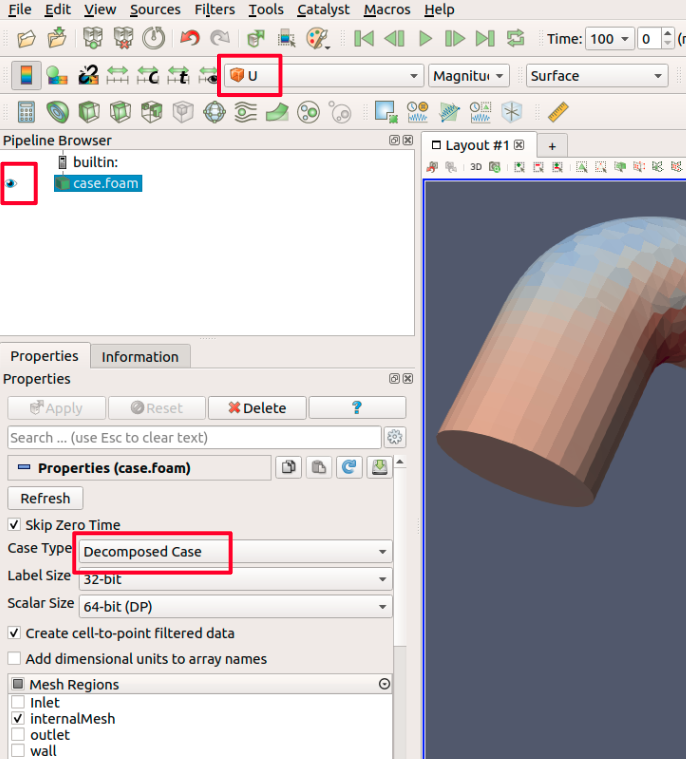

This example contains everything to run a complete [OpenFOAM]-simulation, created by the [CFDOF-Plugin] within [FreeCAD]. 

[FreeCAD]: https://www.freecadweb.org/
[CFDOF-Plugin]: https://github.com/jaheyns/CfdOF
[OpenFOAM]: https://openfoam.org/

First Run
=================================================================

get files
------------------------------------------------------------
You can clone this example-repository directly from gitlab with the command line interface (CLI): 

    cd SOMEWHERE    # (e.g. simulations)
    git clone https://gitlab.com/schlupp/example-cfdof-workflow.git
    # creates a folder "example-cfdof-workflow" with all files inside

with a specified folder like `git clone <REPOSITORY> <FOLDER>` after the the previous command the repository files will be placed inside this folder.  

If you have no internet connection and a downloaded zip file you can extract the files in the GUI or in the CLI to a an arbitrary place: 

    unzip DOWNLOAD.zip -d ARBITRARYFOLDER

installation and troubleshooting
-----------------------------------------------------------
Detailed installation instructions are located in `docs/installation-instructions/*.md`. Especially set the CfdOF-Plugin Output Directory to `.`. 

    doc/installation-instructions/freecad-cfdof.md
    doc/installation-instructions/openfoam.md
    doc/installation-instructions/additional-tools.md

The most important linux commands are shown in this [linux guide](https://cfd.direct/openfoam/linux-guide/)

start meshing and openfoam-solver
------------------------------------------------------------
If everything is setup properly you should be able to start the complete calculation from the root folder directly after downloading with: 

    cd example-cfdof-workflow
    make all

and then the results can be reviewed with paraview:

    make viewResults

Before the flow variables can be seen in Paraview, the results have to be
* marked as visible in the pipeline browser
* to be decomposed `Case Type: Decomposed Case`, if the results are calculated on multiple cores. 
* selected for a special flow variable (e.g. U)  

Complete Workflow
=================================================================

explore all possibilities
-----------------------------------------------------------

Please use an editor to look into `./Makefile`. Here you find a list of tasks (in Makefiles they are called "targets") you can perform within this example. 

    gedit Makefile

all targets can be started with following command in the command line interface: 

    make TARGETNAME

Within the `Makefile` you find a list of targets and after each target with an indent the commands, which will be executed, when you call a specific target.  

    TARGET1:
        target1-bash-command1
        target1-bash-command2

    # non-executed comment for TARGET2  
    TARGET2:
        target2-bash-command1
        target2-bash-command2

To know what you can do, you should read the `Makefile` in the root folder of this project. You should also know how the different targets work to understand the processes. 

FreeCAD
----------------------------------------------------------
With `freecad freecad-cfd.FCStd` or `make openfreecadgui` you can open freecad and loading directly the stored data in the linked freecad-file. 

    freecad freecad-cfd.FCStd

This [FreeCAD-Tutorial] is a good start to get used to FreeCAD for creating 3D Models.  
Now you should have opened FreeCAD and a body with a 3D-geometry. 

[FreeCAD-Tutorial]: https://www.freecadweb.org/wiki/Creating_a_simple_part_with_PartDesign

CfdOF-Plugin (CFD OpenFOAM)
----------------------------------------------------------
To do the CFD preprocessing switch to the CfdOF Workbench inside FreeCAD. 

### creating the CFD-FreeCAD-Container
When you starting from scratch, you need to create the FreeCAD container which are shown afterwards in the tree at the level from `Body`: 
* mark the `geometry/Body` and then "Create an analysis container with a CFD solver" for this Body
* mark the `geometry/Body` and then "Create a mesh using cfMesh, snappyHexMesh or gmsh" for this Body

in this example they are already there

### changing cfd setup
Now you can doubleclick on the different settings and change the values if needed.  
If not existing, for every Face has a boundary condition to be applied. 

### export mesh and case to OpenFOAM text files
When the preprocessing is finished you export the mesh and cfd settings. 
* Doublecklick on `geometry/CFDAnalysis/Body001_Mesh` and execute the "Write mesh case"-Button inside the FreeCAD-Tasks
* Doublecklick on `geometry/CFDAnalysis/CfdSolver` and execute the "Write"-Button inside the FreeCAD-Tasks

These commands will write text files to the subfolders `meshCase` resp. `case` into the directory specified in the CfdOF-Plugin-Settings. 

creating the mesh
----------------------------------------------------------
now you can create and review the mesh with

    cd meshCase
    ./Allmesh

or using the `Makefile` with

    make mesh

Review the file `meshCase/Allmesh` for a detailed review of the meshing process and read from the [OpenFOAM-documentation] the [OpenFOAM-User-Guide]. [Chapter-5] covers the meshing process

[OpenFOAM-documentation]: https://cfd.direct/openfoam/documentation/  
[OpenFOAM-User-Guide]:    https://cfd.direct/openfoam/user-guide/  
[Chapter-5]:              https://cfd.direct/openfoam/user-guide/v7-mesh/#x23-1670005  

starting the cfd calculation
----------------------------------------------------------
with the created mesh you can start the calculation and review the results with

    cd case
    ./Allrun

or using the `Makefile` with

    make run

Review the file `meshCase/Allrun` for a detailed review of the meshing process and read from the [OpenFOAM documentation](https://cfd.direct/openfoam/documentation/) the [OpenFOAM User Guide](https://cfd.direct/openfoam/user-guide/). 

explore folder structure
=================================================================
to get a first idea you should look at the filetree inside the example with different options 

    tree . -d -L 2      # only directories and two levels deep
    tree . -d           # only directories
    tree .              # all files and folders

following is the output from `tree . -d -L 2` of this repository before OpenFOAM writes the output data. Redo this command after every creating data to see the differences.

    .
    ├── case
    │   ├── 0.org
    │   ├── constant
    │   └── system
    ├── doc
    │   └── resources
    └── meshCase
        ├── constant
        └── system

the file structure is documented in [Chapter 4.1 from the User Guide](https://cfd.direct/openfoam/user-guide/v7-case-file-structure/#x16-1220004.1)

### doc
in `./doc` are different additional information stored in Markdown (*.md) files.

### meshCase & case
in `./meshCase` and `./case` are the from FreeCAD exported setting files for OpenFOAM. The `Allmesh` resp. `Allrun` inside these folders should directly create the mesh resp. the calculation results inside these folders.  

