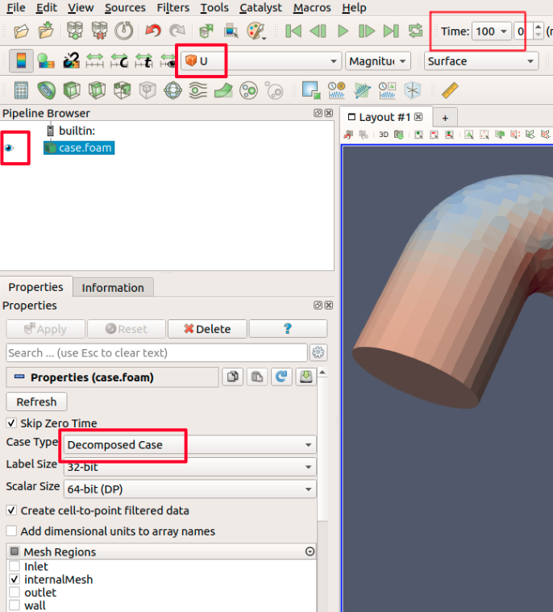
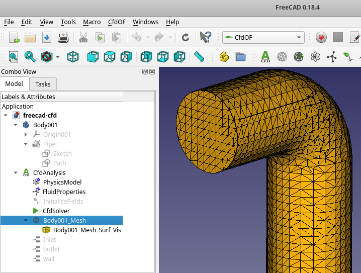

Welcome to my example to run a complete [OpenFOAM]-simulation, created by the [CFDOF-Plugin] within [FreeCAD]. 

First Run
=================================================================

The first run is to do a functional test of your personal cfd-installation and do an automatic run without changes.  

get files
------------------------------------------------------------
To do a cfd-simulation you need a cfd-setup. 
Therefore you clone (copy) this example-repository directly from GitLab with the command line interface (CLI): 

    cd <SOMEWHERE>    # (e.g. /home/USER/simulations)
    git clone https://gitlab.com/schlupp/example-cfdof-workflow.git
    # creates a folder "example-cfdof-workflow" with all files inside

with a specified folder like `git clone <REPOSITORY> <FOLDER>` after the the previous command the repository files will be placed inside this folder.  

If you have no internet connection and a downloaded zip file you can extract the files in the GUI or in the CLI to a an arbitrary place: 

    unzip <DOWNLOAD>.zip -d <ARBITRARYFOLDER>

installation and troubleshooting
-----------------------------------------------------------
Detailed installation instructions for all operating systems are located in [`docs/installation-instructions/*.md`](docs/installation-instructions/README.md). 
Especially set the CfdOF-Plugin Output Directory to `.`. 

[doc/installation-instructions/freecad-cfdof.md](docs/installation-instructions/freecad-cfdof.md)  
[doc/installation-instructions/openfoam.md](docs/installation-instructions/openfoam.md)  
[doc/installation-instructions/additional-tools.md](docs/installation-instructions/additional-tools.md)  

The most important linux commands are shown in this [linux-guide]. 
These are essential and you should try at least 60% and understand the meaning from all. 

start meshing and openfoam-solver
------------------------------------------------------------
If the installation is setup properly you should be able to start the complete calculation from the repository root folder. 
At Windows this should be also executed in [WSL](docs/installation-instructions/openfoam.md#option-1-windows-subsystem-for-linux-wsl) Linux:  

    cd example-cfdof-workflow
    make all

Postprocessing
------------------------------------------------------------
Afterwards some results can be reviewed with Paraview. 
In Windows you open Paraview from "Windows Search" and you open the file `pv.foam` in the `case`-folder. 
In native Linux you execute: 

    make view-results

Before you the flow variables you have to do some preparation in Paraview:  

* if the results are calculated on multiple cores, the results must be decomposed,  
  select `Case Type: Decomposed Case` and click on `Apply`  
* the results have to be, marked as visible in the pipeline browser (eye in picture below),  
* the last timestep (even for a mesh) has to be selected from the dropdown menu,  
* a flow variable from the results (e.g. p, U, ...) must be selected.  

afterwards you should see something like the pipe on the right side from the above picture

Technical Remarks  
=================================================================

If everything is setup correctly you can start to look deeper in the scripts & files to understand the entire cfd workflow. 

Makefile - a dictionary for your possible cli tasks
-----------------------------------------------------------

First you should use your preferred editor to look into the `./Makefile` to see the different tasks which you can perform. 
These tasks (in Makefiles they are called "targets") you can execute within this example. 
You should also know how the different targets work 

    gedit Makefile

all targets can be started with following command in the command line interface: 

    make TARGETNAME

Within the `Makefile` you find a list of targets and after each target with an indent the commands, which will be executed, when you call a specific target.  
~~~Makefile
TARGET1:
    target1-bash-command1
    target1-bash-command2

# non-executed comment for TARGET2  
TARGET2:
    target2-bash-command1
    target2-bash-command2
~~~

meshCase & case folder
-----------------------------------------------------------
In general FreeCAD don't performs the CFD calculation. 
The FreeCAD-CFDOF-Plugin writes/exports the setup-data, which can be processed by OpenFOAM. 
For the mesh this data is written in the folder `meshCase` and for the cfd calculations this data is written in `case`. 

To make this example more robust the cfd-setup is already exported to these two folders. 
But if you want, you can delete them and recreate them from within FreeCAD. 

Detailed CFD Workflow
=================================================================

Knowing everything works fine, we now can look deeper in the cfd workflow. 

.0. Define your project
----------------------------------------------------------
Before you start, think about your expectations of this cfd project. 
* Why are you doing this? 
* What did you want to know? 
* What assumptions can you tolerate without loosing the accuracy you need? 

If you did not answer these kind of project management questions before you start, you will be lost during the process and not succeed!

.1. CFD Preprocessing: FreeCAD GUI preprocessing with CfdOF-Plugin
----------------------------------------------------------
With the project conditions in mind you can start with the preprocessing. 
These are:  
* creating a geometry
* converting the geometry to a mesh
* setup the physical parameters for the simulation 

### Step 1: creating/modifying a geometry
Normally you start with an empty file or get some basic CAD files from your construction departement. 
Keep in mind: You do not model the pipe, **you model the volume inside the pipe**. 

This [FreeCAD-Tutorial] is a good start to get used to FreeCAD for creating 3D Models.  

Now open FreeCAD. 
At Windows use your "Windows Search"
At a native Linux you can open FreeCAD with `freecad freecad-cfd.FCStd` or `make open-freecad` and loading directly the already prepared data in the linked freecad-file. 

    freecad freecad-cfd.FCStd

On the left side in the model tree all content in this file is listed.  
  
To toggle the visibility of specific entries you can mark some and hit the space bar. 
To getting to know each entry make all entries invisible (greyed out) and test what is appearing when you switch it to visible again. 

### Step 2: creating/modifying the mesh setup
To do the CFD preprocessing switch to the CfdOF Workbench inside FreeCAD. 

#### init: creating the CFD-FreeCAD-Container
When you starting from scratch, you need to create the FreeCAD `CFDAnalysis` container which is shown in the tree at the level of and below `Body`: 
* mark the `geometry/Body` and then "**Create an analysis** container with a CFD solver" for this Body
* mark the `geometry/Body` and then "**Create a mesh** using cfMesh, snappyHexMesh or gmsh" for this Body

in this example this container are already there

#### change
To change the mesh settings doubleclick on `CFDAnalysis/Body001_Mesh`. 
In the following popping up `Tasks` menu (the second register beside the model tree) you can change the basic values. 
Some values can also be changed in the properties menu below the model tree. 

#### export to meshCase
When you finished your work, execute the `Write mesh case`-Button inside the FreeCAD-Tasks. 
These command writes text files to the subfolders `meshCase` into the directory specified in the CfdOF-Plugin-Settings. 
These files can be executed afterwards with OpenFOAM to build the mesh. 

#### verify your output
Now remove the folder `meshCase` and export it again, to verify the correct output path of the [FreeCAD-CfdOF-Plugin](docs/installation-instructions/freecad-cfdof.md#set-output-directory). 

### Step 3: creating/modifying the cfd setup
The initialization was already done by the mesh creation process. 

Therefore you can doubleclick on the different settings and change the values if needed. 
Also you can change values in the properties windows. 
If not existing, for every Face has a boundary condition to be applied. 

#### export to case
When the preprocessing is finished you export the mesh and cfd settings. 
Doublecklick on `CFDAnalysis/CfdSolver` and execute the `Write`-Button inside the FreeCAD-Tasks

These commands will write text files to the subfolder `case` into the directory specified in the CfdOF-Plugin-Settings, similar to `meshCase`. 

.2. CFD meshing: create a mesh
----------------------------------------------------------
The geometry creation and meshing setup is already prepared in the previous section with Freecad.  
Therefore you can now create the mesh based on the text and stl-files in the folder `meshCase`. 
For this step you have to enter the WSL or Linux terminal and execute:

    cd meshCase
    ./Allmesh

or using the `Makefile` in the project root directory with the command: 

    make mesh

### test success
these commands should create a lot terminal output with the final lines:

    // * * * * * * * * * * * * * * * * * * * * * * * * * * * * * * * * * * * * * //
    Reading surf from "mesh_outside.stl" ...
    Writing surf to "mesh_outside.stl" ...
    Scaling points by (1000 1000 1000)
    End

Beside others the file `meshCase/constant/polyMesh/points` should be created and hold a lot of points. 

### review the meshing process & the mesh
Review the file `meshCase/Allmesh` for detailed information of the meshing process and read from the [OpenFOAM-documentation] the [OpenFOAM-User-Guide]. 
[Chapter-5] covers the meshing process.  

Then you should have a look in the created files, to get a feeling of the process. 
They are in the folder `meshCase/constant/polyMesh` and especially in the file `points`. 

Afterwards you should review the created mesh within the 3D viewer Paraview. 
At Windows start from the Search and in Linux execute: 

    make view-mesh

.3. CFD solving: starting the calculation
----------------------------------------------------------
with the created mesh in `meshCase` and the exported setup-files in the folder `case` you can start the calculation in WSL or Linux with: 

    cd case
    ./Allrun

or using the `Makefile` with

    make run

### test success
If the calculation runs, there is a lot of terminal output. 
At the end there shoud be a success message like: 

    GAMG:  Solving for p, Initial residual = 1.2947568e-08, Final residual = 1.8387204e-09, No Iterations 1
    time step continuity errors : sum local = 1.1281226e-08, global = 3.6351064e-09, cumulative = -5.0078224e-06
    smoothSolver:  Solving for omega, Initial residual = 9.7324543e-06, Final residual = 5.9005793e-07, No Iterations 3
    smoothSolver:  Solving for k, Initial residual = 8.9986853e-05, Final residual = 5.6533897e-06, No Iterations 3
    ExecutionTime = 3.16 s  ClockTime = 3 s

    SIMPLE solution converged in 106 iterations

    End

    Finalising parallel run

In the folder `case/processor0/100` or `case/100` you find for the timestep `100` files with the values for pressure (`p`) or velocities (`U`). 

### review
Review the file `meshCase/Allrun` for a detailed review of the calculation process and read from the [OpenFOAM-documentation] the [OpenFOAM-User-Guide]. 

Then you should explore folder structure in `case`.  
Before calculation starts three folders exists:  
~~~bash
├── case
│   ├── 0.org
│   ├── constant
│   └── system
~~~
the file structure is documented in [Chapter-4.1] from the User Guide.

.4. CFD postprocessing: Review the output
----------------------------------------------------------
Afterall now its time to review the computed fluid flow. 
This might be the last step of a long journey and you might be exhausted, but this is the most important part. 
Here you get your information you can use to answer the questions you posed in chapter 0. 
So **take your time and investigate the flow** before you start your next calculation. 

Open ParaView as already described in the [postprocessing section](#postprocessing).  

Keep in mind: **Do only small changes to the cfd setup** and verify the results after every change.  
With to big steps you cannot draw solid conclusions. 

Further Resources
=================================================================

in `./doc` are different additional information stored in Markdown (*.md) files.

[FreeCAD]:                  https://www.freecadweb.org/
[FreeCAD-Tutorial]:         https://www.freecadweb.org/wiki/Creating_a_simple_part_with_PartDesign 
[CFDOF-Plugin]:             https://github.com/jaheyns/CfdOF
[OpenFOAM]:                 https://openfoam.org/

[linux-guide]:              https://cfd.direct/openfoam/linux-guide/

[OpenFOAM-documentation]:   https://cfd.direct/openfoam/documentation/  
[OpenFOAM-User-Guide]:      https://cfd.direct/openfoam/user-guide/  
[Chapter-4.1]:              https://cfd.direct/openfoam/user-guide/v7-case-file-structure/#x16-1220004.1
[Chapter-5]:                https://cfd.direct/openfoam/user-guide/v7-mesh/#x23-1670005  
