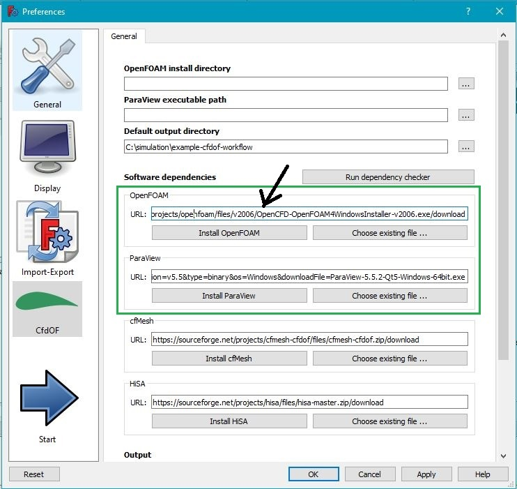

FreeCAD-CfdOF Remarks
==============================================================================

FreeCAD is not directly linked to OpenFOAM. 
The CfdOF plugin will only write the text input files, which will be read by OpenFOAM. 
So you can run FreeCAD native under Windows and OpenFOAM within the Windows Subsystem for Linux (WSL). 
Its only important, that every software can write in the same directories.  

FreeCAD Installation
==============================================================================

on Linux
---------------------------------------------------------------------
[FreeCAD installation wiki](https://www.freecadweb.org/wiki/Install_on_Unix)

add an apt-repository to tell Linux where he finds the latest version and get freecad 0.18.x

    sudo add-apt-repository ppa:freecad-maintainers/freecad-stable
    sudo apt-get update

install freecad from packages 

    sudo apt-get install freecad freecad-doc
    sudo apt-get upgrade

### use daily builds
use daily builds when something went wrong  
https://wiki.freecadweb.org/Install_on_Unix#Daily_PPA_through_the_console  

    sudo add-apt-repository ppa:freecad-maintainers/freecad-daily
    sudo apt-get update
    sudo apt-get install freecad-daily

on Windows
---------------------------------------------------------------------
1. Download FreeCAD from [freecadweb.org](https://www.freecadweb.org/downloads.php) 
2. install the Download
3. read [CfdOF-github](https://github.com/jaheyns/CfdOF) remarks and proceed the install of CfdOF Workbench with the FreeCAD Addon Manager described in the next chapter

If something is not working well, consider to download a [developer-version](https://github.com/FreeCAD/FreeCAD/releases/)  

CfdOF-Plugin
==============================================================================

Installation
---------------------------------------------------------------------
The CfdOF-Plugin can be installed in the FreeCAD-GUI with the [AddOn-Manager](https://wiki.freecadweb.org/Std_AddonMgr).  
Problems with the Addon-Manager are discussed at the [Debug-Page](https://github.com/FreeCAD/FreeCAD-addons).   

To install the CfdOF-Plugin follow OS dependent instructions from the [CfdOF Readme](https://github.com/jaheyns/CfdOF), which are summarized in the next lines.  

### Plot Workbench
[source code](https://github.com/FreeCAD/freecad.plot)  

-> File -> Tools -> Addon-Manager  
-> Install "Plot" Workbench link  
Restart FreeCAD  

### CfdOF Workbench
previous Restart of FreeCAD is important  
-> File -> Tools -> Addon-Manager  
-> Install "CfdOF" Workbench link  
Restart FreeCAD again  

### Disable unnecessary workbenches (optional)
[Freecad-Wiki](https://www.freecadweb.org/wiki/Interface_Customization)  

Menu -> Tools -> Customize  

CfdOF Settings
---------------------------------------------------------------------
[CfdOF github repository](https://github.com/jaheyns/CfdOF)  

FreeCAD -> File -> Edit -> Preferences -> CFDOF

### install directory
On **Linux** set OpenFOAM directory to: 
~~~
/opt/openfoam7
~~~

On **Windows** this remains empty 

### Set Output directory 
It is important to know where CfdOF will write your files. 

If this is a constant folder like `/tmp` you will always copy the files from here to your project. 
Its better so start FreeCAD from the terminal at a certain place and export relative from there.  

    .

When you don't start FreeCAD at a certain place you must consider to write a script to import the exported data automatically in your project. 

Install CfdOF Dependencies
---------------------------------------------------------------------
FreeCAD -> File -> Edit -> Preferences -> CfdOF

Install with the buttons at least:

* OpenFOAM (only on Windows)
* ParaView (only on Windows)
* cfMesh

Click on `Run dependency checker` and look in the output if its telling you something about missing openfoam files.  
gmsh is not necessary. 

Optional FreeCAD customization
==============================================================================

remove unnecessary workbenches
------------------------------------------------------------------------------
https://www.freecadweb.org/wiki/Interface_Customization  
Menu -> Tools -> Customize  
  

Examples & Tutorials
==============================================================================

first 3D part
---------------------------------------------------------------------

[tutorial1](https://www.freecadweb.org/wiki/Creating_a_simple_part_with_PartDesign)  

* chose "Part Design Workbench"
* Tasks
    * create Body
    * create Sketch
* Save

Docs
---------------------------------------------------------------------

https://www.freecadweb.org/wiki/Tutorials
