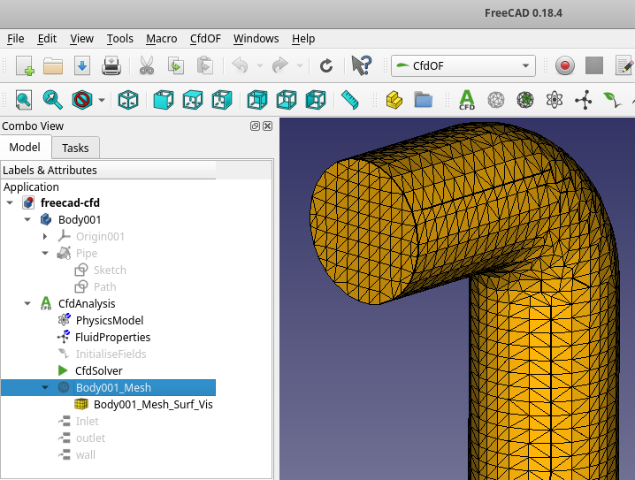

Creating the Geometry
======================================================================

Create the Fluid Body
------------------------------------------------------------

Normally you start with an empty file or get some basic CAD files from your construction departement. 
Keep in mind: You do not model the pipe, **you model the volume inside the pipe**. 

This [FreeCAD-Tutorial] is a good start to get used to FreeCAD for creating 3D Models.  

Now open FreeCAD. 
At Windows use your "Windows Search"
At a native Linux you can open FreeCAD with `freecad freecad-cfd.FCStd` or `make freecad-open` and loading directly the already prepared data in the linked freecad-file. 

    freecad freecad-cfd.FCStd

On the left side in the model tree all content in this file is listed.  
  

Choose the Workbench "Part Design" or "Part" and start the creating process. 

Check Success
------------------------------------------------------------

### Mesh Part by Visibility
Left beside every item in the tree is an eye, which can be used to toogle the visibility of specific items. 
Hide all items, so that nothing is visible. 

Now make only the part visible, which you want to use for the mesh. 
This part: 
* should contain only the areas where fluid will flow. 

RESOURCES
------------------------------------------------------------

[FreeCAD-Tutorial]:         https://www.freecadweb.org/wiki/Creating_a_simple_part_with_PartDesign 
