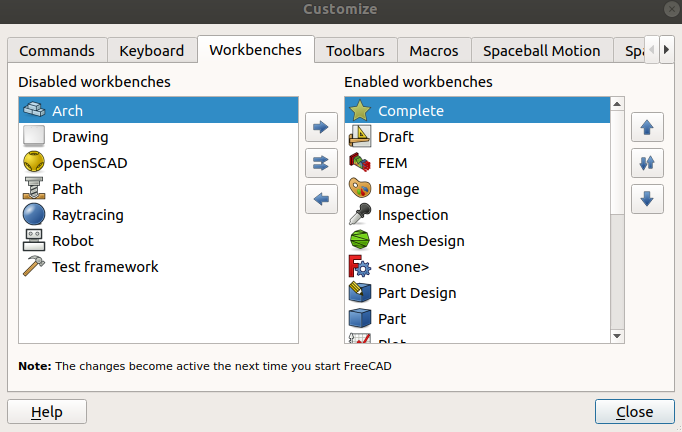
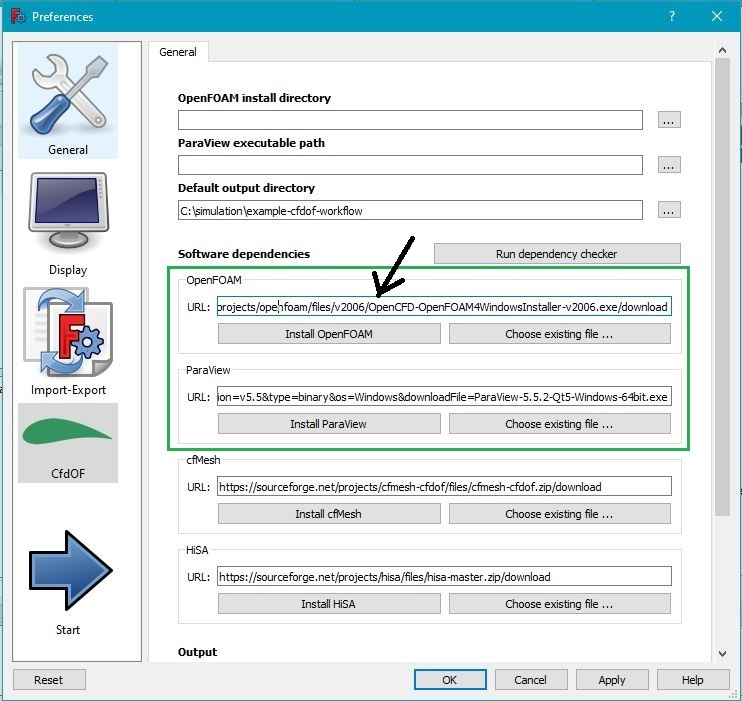
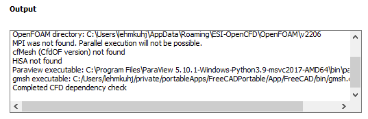

FreeCAD-CfdOF Remarks
==============================================================================

FreeCAD is not directly linked to OpenFOAM. 
The CfdOF plugin will only write the text input files, which will be read by OpenFOAM. 
So you can run FreeCAD native under Windows and OpenFOAM within the Windows Subsystem for Linux (WSL). 
Its only important, that every software can write in the same directories.  

FreeCAD Installation
==============================================================================

on Linux
---------------------------------------------------------------------
[FreeCAD installation wiki](https://www.freecadweb.org/wiki/Install_on_Unix)

add an [apt-repository] to tell Linux where he finds the latest stable version of freecad: 

    sudo add-apt-repository ppa:freecad-maintainers/freecad-stable
    sudo apt-get update

[apt-repository]: https://launchpad.net/~freecad-maintainers/+archive/ubuntu/freecad-stable

install freecad from packages 

    sudo apt-get install freecad
    sudo apt-get upgrade

### use daily builds
try [daily builds] when something went wrong  
https://wiki.freecadweb.org/Install_on_Unix#Daily_PPA_through_the_console  

    sudo add-apt-repository ppa:freecad-maintainers/freecad-daily
    sudo apt-get update
    sudo apt-get install freecad-daily

[daily builds]: https://launchpad.net/~freecad-maintainers/+archive/ubuntu/freecad-daily

on Windows
---------------------------------------------------------------------
1. Download FreeCAD from [freecadweb.org](https://www.freecadweb.org/downloads.php) 
2. install the Download
3. read [CfdOF-github](https://github.com/jaheyns/CfdOF) remarks and proceed the install of CfdOF Workbench with the FreeCAD Addon Manager described in the next chapter

If something is not working well, consider to download a [developer-version](https://github.com/FreeCAD/FreeCAD/releases/)  

Optional FreeCAD customization
------------------------------------------------------------------------------

### remove unnecessary workbenches
[Freecad-Wiki](https://www.freecadweb.org/wiki/Interface_Customization)  

>Menu -> Tools -> Customize  

  

CfdOF-Plugin
==============================================================================

Installation
---------------------------------------------------------------------
The CfdOF-Plugin can be installed in the FreeCAD-GUI with the [AddOn-Manager](https://wiki.freecadweb.org/Std_AddonMgr).  
Problems with the Addon-Manager are discussed at the [Debug-Page](https://github.com/FreeCAD/FreeCAD-addons).   

To install the CfdOF-Plugin follow OS dependent instructions from the [CfdOF Readme](https://github.com/jaheyns/CfdOF), which are summarized in the next lines.  

### Plot Workbench
[source code](https://github.com/FreeCAD/freecad.plot)  

-> File -> Tools -> Addon-Manager  
-> Install "Plot" Workbench link  
Restart FreeCAD  

### CfdOF Workbench
previous Restart of FreeCAD is important  
-> File -> Tools -> Addon-Manager  
-> Install "CfdOF" Workbench link  
Restart FreeCAD again  

CfdOF Settings
---------------------------------------------------------------------
[CfdOF github repository](https://github.com/jaheyns/CfdOF)  

FreeCAD -> File -> Edit -> Preferences -> CFDOF

### install directory
On **Linux** set OpenFOAM directory to: 
~~~
/opt/openfoam11
~~~

On **Windows** this remains empty but you have to install later more [dependencies](#openfoam-only-on-windows).  

### Set Output directory 
It is important to know where CfdOF will write your files. 

If this is a constant folder like `/tmp` you will always copy the files from here to your project. 
Its better so start FreeCAD from the terminal at a certain place and export relative from there.  

    .

When you don't start FreeCAD at a certain place you must consider to write a script to import the exported data automatically in your project. 

Install CfdOF Dependencies
---------------------------------------------------------------------
FreeCAD -> File -> Edit -> Preferences -> CfdOF

Install with the buttons at least:  

### OpenFOAM (only on Windows)
On Windows you need this second OpenFOAM installation for the data export from CfdOF plugin, because the CfdOF plugin cannot access the installation in the Windows Subsystem for Linux (WSL).  

When you try to export the meshCase files something like this occurs in the "Report view":  
~~~c
15:50:16  Populating mesh dictionaries in folder C:\Users\lehmkuhj\tmp\meshCase
15:50:16  Traceback (most recent call last):
15:50:16    File "C:\Users\lehmkuhj\AppData\Roaming\FreeCAD\Mod\CfdOF\.\CfdOF\Mesh\TaskPanelCfdMesh.py", line 222, in writeMesh
15:50:16      FreeCADGui.doCommand("cart_mesh.writeMesh()")
15:50:16    File "<string>", line 1, in <module>
15:50:16    File "C:\Users\lehmkuhj\AppData\Roaming\FreeCAD\Mod\CfdOF\.\CfdOF\Mesh\CfdMeshTools.py", line 84, in writeMesh
15:50:16      self.writeMeshCase()
15:50:16    File "C:\Users\lehmkuhj\AppData\Roaming\FreeCAD\Mod\CfdOF\.\CfdOF\Mesh\CfdMeshTools.py", line 693, in writeMeshCase
15:50:16      'FoamRuntime': CfdTools.getFoamRuntime(),
15:50:16    File "C:\Users\lehmkuhj\AppData\Roaming\FreeCAD\Mod\CfdOF\.\CfdOF\CfdTools.py", line 584, in getFoamRuntime
15:50:16      raise IOError("OpenFOAM installation path not set and not detected")
15:50:16  OSError: OpenFOAM installation path not set and not detected
~~~

With hitting the "Install OpenFOAM"-Button the ESI Version of OpenFOAM ist installed at Windows in following folder:  

    C:\Users\lehmkuhj\AppData\Roaming\ESI-OpenCFD\OpenFOAM\v2206

### ParaView (only on Windows)
Paraview ist installed in a different 

    C:\Program Files\ParaView 5.10.1-Windows-Python3.9-msvc2017-AMD64

### cfMesh
Is nice to have but not necessary.  

### Check 
Click on `Run dependency checker` and look in the output if its telling you something about missing openfoam files.  
`gmsh` is not necessary. 

Examples & Tutorials
==============================================================================

first 3D part
---------------------------------------------------------------------

[tutorial1](https://www.freecadweb.org/wiki/Creating_a_simple_part_with_PartDesign)  

* chose "Part Design Workbench"
* Tasks
    * create Body
    * create Sketch
* Save

Docs
---------------------------------------------------------------------

https://www.freecadweb.org/wiki/Tutorials
