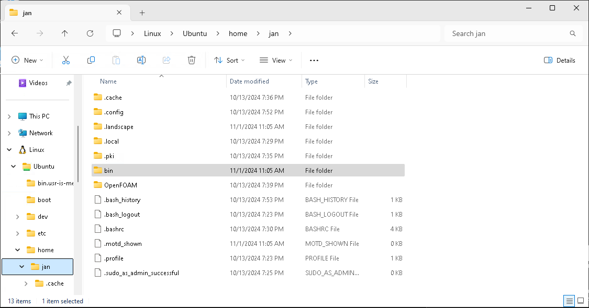

Manual Paraview Installation in Linux
======================================================================

This should only be necessary, when the [Python in Paraview](paraview.python.md) is not working.  

Preparation
------------------------------------------------------------

    paraview --version 

should lead to an error. 
Otherwise you should deinstall the current version of ParaView maybe with: 

    sudo apt remove paraview

Download & Extract
------------------------------------------------------------

[Download](https://www.paraview.org/download/) the **Linux X64** executable (e.g. `ParaView-5.13.1-MPI-Linux-Python3.10-x86_64.tar.gz`). 
Use `osmesa` version for headless machines without x-server like Docker, when you have no GUI.  

Create a folder where you will place the binary files. 
In Linux or WSL a good place might be: 

    ~/bin
    \\wsl.localhost\Ubuntu\home\jan\bin

  

Copy the downloaded `*.tar.gz` file to the new `bin` folder.  
Extract the `*.tar.gz` file with tar inside the terminal (WSL): 

    cd ~/bin
    tar --extract --file ParaView-5.13.1-MPI-Linux-Python3.10-x86_64.tar.gz

Make paraview, pvbatch and pvpython available from terminal
------------------------------------------------------------

"pvbatch" from the downloaded paraview must be available from command line. 
The places where a terminal searches for programs are defined in the PATH variable. 

    echo $PATH | tr : '\n'

Choose from this list an adequate folder like `/usr/local/bin`.
Then create in this folder softlinks to the desired program files. 
Remove the `sudo` prefix if you use a folder in your home. 

    cd /usr/local/bin

    sudo ln -s ~/bin/ParaView-XXXXX/bin/pvbatch
    sudo ln -s ~/bin/ParaView-XXXXX/bin/pvpython
    sudo ln -s ~/bin/ParaView-XXXXX/bin/paraview

Open a new terminal that this changes take effect. 
Test installation version with following commands, which should refer to your new ParaView version: 

    paraview --version
    pvbatch  --version
    pvpython --version
    which paraview
    which pvbatch
    which pvpython

Do not source everything in `*/paraview/bin`. 
This can lead to unexpected behaviour e.g. with `mpiexec`.  
