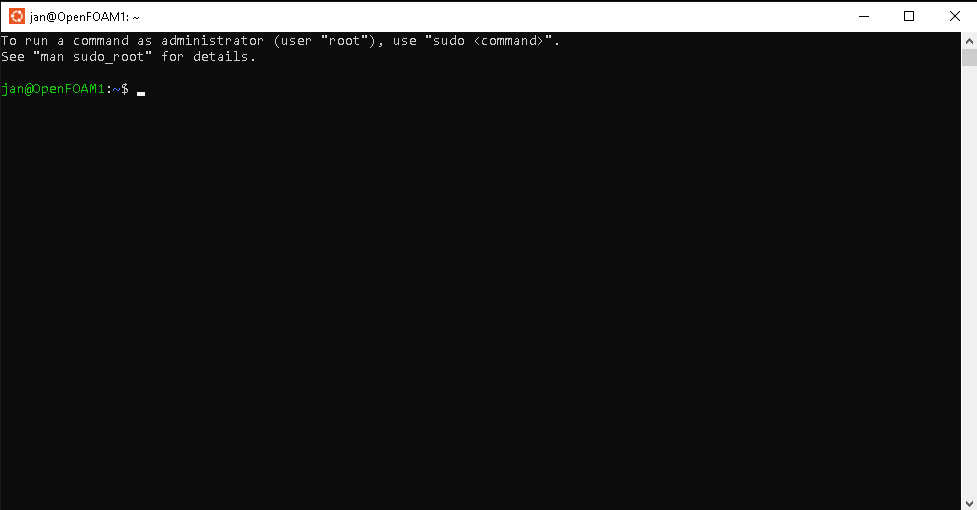

Windows Subsystem for Linux (WSL)
======================================================================

A [Windows-10-installation] should be possible with the builtin "Windows Subsystem for Linux" (WSL) in Windows 10. 
Beside the [WSL-activation] the installation should be very similar to the Linux installation described in the [next chapter](#openfoam-installation-on-linux).  

### WSL Installation
1. read: [openfoam.org-help](https://openfoam.org/download/windows-10/)

2. Activate Windows Subsystem for Linux (WSL) like described in [WSL-activation].  
   For the first time you need Administrator rights in the Powershell to execute:  
   
        wsl --install

   Then restart

3. install your desired Distro from `Microsoft Store` or 
   use Ubuntu, which should be installed by default after restart. 
   At the end you can open Linux/WSL by typing e.g. "Ubuntu" in your Windows Search and get a terminal like:  
   >   

4. Install OpenFOAM inside WSL described in the Linux-Installation-Chapter below  

[Windows-10-installation]: https://openfoam.org/download/windows-10/  
[WSL-activation]: https://learn.microsoft.com/en-gb/windows/wsl/install  

### hard disc access
The hard-disks (e.g. `C:`, `D:`) are mounted in the WSL at `/mnt/c` and `/mnt/d`. 
To access these data change your directory (`cd`) to these folders:

    cd /mnt/c/YOURDIRECTORY

RESOURCES
======================================================================

[openfoam.org/download/windows](https://openfoam.org/download/windows/)  
